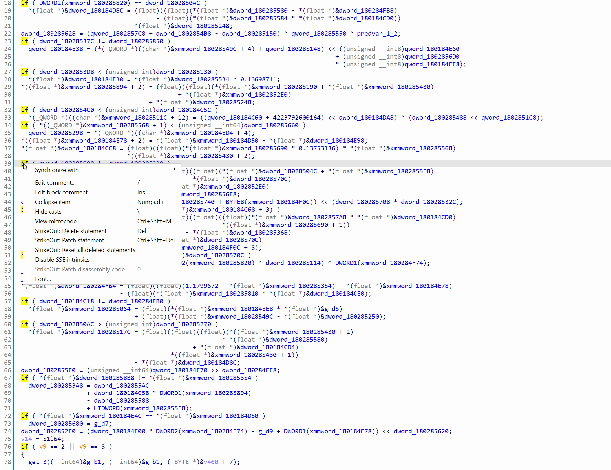
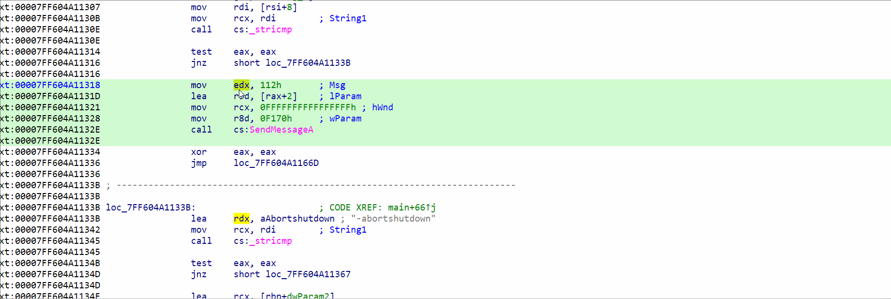

# Introduction

StrikeOut is an plugin for the Hex-Rays Decompiler. It allows you to delete (hide) statements from the AST, thus simplifying the pseudocode output.
This is a useful scenario when you are dealing with lots of junk code or code that don't necessarily increase your understanding of the pseudocode.

## Features:

- Delete a statement and its children
- Patch a statement (with NOP) and its children (x86 arch. only)
- Persistence
- Undo support
- Patch code (in the disassembly) view with NOPs

# Building

StrikeOut is a regular plugin and is built using [ida-cmake](https://github.com/0xeb/ida-cmake).
There are release pre-built for MS Windows.

# Use cases

- Patching out the disassembly from the pseudocode window
- Cleaning up ugly / 'useless' pseudocode lines
- Manually cleaning opaque predicates from the pseudocode window

- Patching the disassembly code with NOPs

